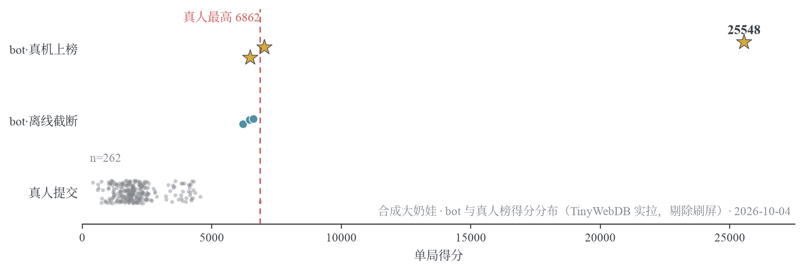

# bignaiwa-bot — 合成大奶娃自动对局

> **English**: An autonomous bot for the Suika-like merge game [合成大奶娃 / BigNaiWa](https://yhsome.github.io/BigNaiWa/). Instead of learning an environment model, it *is* the model: every decision snapshots the live game state, simulates ~20 candidate drops through the game's own deterministic physics, scores each settled board with a 17-feature linear evaluator (weights found by CEM black-box optimization), and plays the argmax. On the real leaderboard it scored **25,548** — roughly 3.7× the best recorded human score (6,862) — after 91 minutes and 2,460 drops with 16 revives spent. No training data, no neural network, no RPC: the same code runs offline (seeded sandbox, for tuning) and inside the real page (for deployment).

[](LICENSE)

| 爆炸瞬间（+717） | 判负复活（币−1，清顶续局） | 终局冲刺（25,548） |
|---|---|---|
|  |  |  |

左上角黑框是决策徽章（第 N 投 / 落点 x / 思考耗时 / 当前分）——决策是同步阻塞的，页面时钟天然冻结，推演不占对局时间。

## 战绩

- **真机上榜**：3 局全部提交排行榜 —— **25,548** / 6,468 / 7,023（2026-10-04，录屏与逐投日志见 `recordings/`，91 分钟全程 20 倍速视频 `game1-25548-20x.mp4`）。榜单为滚动 20 条窗口，随后被第三方刷频提交占满、本 bot 成绩已不可在榜窗复核——第三方佐证以录屏与日志为准
- **对比人类**：榜窗真人集中 1.2k–4k，历史最高 6,862（TinyWebDB 实拉 n=262 快照，见 `docs/figs/leaderboard_snapshot.json`）→ 本 bot 最佳 = 榜首 **3.7 倍**
- **离线跑批**：depth1 600 投截断中位 ~6.3k；分布双峰——早夭 <5k vs 入复活币正循环 >14k（E1/E18）
- **对照基线**：random ~200、启发式 ~1.8k、粗网格搜索 3.8k → 本系统 14.7k（12 局 × 3000 投）



*262 条真人提交（灰点）挤在 7k 以下；bot 离线 600 投截断（青点）已贴住真人上限；真机三局（金星）两局贴顶、一局 25,548 飞出榜首 3.7 倍。红线为真人最高 6,862。*

## 怎么做到的（30 秒版）

```
每个决策点:  快照盘面 ──► ~20 个候选落点 ──► 各自完整模拟「投放→沉降」
          ──► 17 维特征 · 权重向量 打分 ──► argmax 投放
```

- **物理即模型**：游戏引擎确定、无随机、状态可整体快照——"模拟推演"就是零误差的真实后果预览，不需要学环境模型
- **二层前瞻**：top-4 候选再展开一步，提前看见"这步会给下步留死局"（E10：唯一显著增益项，消灭灾难性早夭）
- **权重**：CEM 黑盒调优（对数正态扰动 + 精英几何均值 + 混合难度种子集），回归拟合路线已实证证伪（E4b/E9b）
- **复活币经济**：每 2000 分 1 币、判负耗币清顶续命；活过 ~7k 进入币进 > 币出的正循环——压早夭率是全部调优的隐含目标

细节阅读顺序：[docs/algorithm.md](docs/algorithm.md)（算法详解）→ [docs/design.md](docs/design.md)（系统设计与机制建模）→ [docs/experiments.md](docs/experiments.md)（全部实验日志 E0–E18，含负结果）→ [docs/tuning.md](docs/tuning.md)（调权管线）。

## 快速开始

要求：Node.js ≥ 18；页面部署需 `npx playwright install chromium`。

```bash
npm install

# 离线跑批：12 局并行，种子化可复现
node src/run/batch.js search 12 '{"depth":1,"grid":16}'

# 动态深度（危险态才开二层前瞻，接近 depth1 的成本）
node src/run/batch.js search 12 '{"dyn":{"topPx":172,"ot":0.3},"grid":16}'

# 页面部署：打包 → Playwright 驱动真实页面（默认 SUBMIT=false 真打不上榜）
node src/deploy/bundle.mjs
node src/deploy/live.mjs --games 3
# 真上榜（请自重——这是公共排行榜）:
node src/deploy/live.mjs --games 1 --submit
```

其他 agent：`random` / `match` / `sorted`（基线对照）。权重调优见 `src/run/tune_cem.js`（CEM，`REMOTE='host:N'` 支持 ssh 跨机并行）。

## 目录

```
vendor/     原版游戏代码（物理唯一真源，只读；作者 yhsome）
src/
  core.js     快照/恢复/帧推进/沉降判据/投放
  env.js      Node vm 种子化离线沙盒（mulberry32 RNG + 手动时钟）
  eval.js     17 维局面评估
  agents/     search（前瞻搜索）、simple（基线）、mc（审计用）
  run/        batch 跑批 / tune_cem 调权 / probe_traj 探针 / export_data 数据导出
  deploy/     bundle.mjs 打包 / inject.js 页面内 bot / live.mjs Playwright 驱动
docs/       design.md · algorithm.md · tuning.md · experiments.md · figs/ · media/
rl/         策略-价值网络蒸馏管线（预留，当前未启用——见 docs 负结果分析）
```

## 结果与可复核性

所有结论都可复核：种子化环境 + 完整实验日志（`docs/experiments.md`，含方法、数据、负结果）。几个值得看的负结果：回归拟合权重实战崩盘（E9b）、短程 MC 估值机械负相关（E10'）、线性空间近饱和（E15）——比正结果更能省你的时间。

## License

MIT（见 [LICENSE](LICENSE)）。游戏本体版权归 [yhsome](https://yhsome.github.io/BigNaiWa/)，`vendor/` 仅供研究复现。
